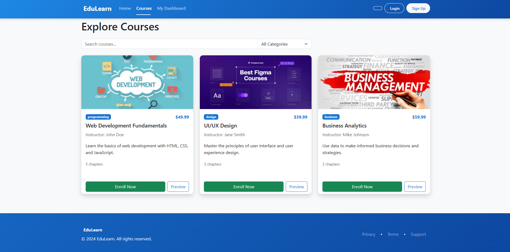
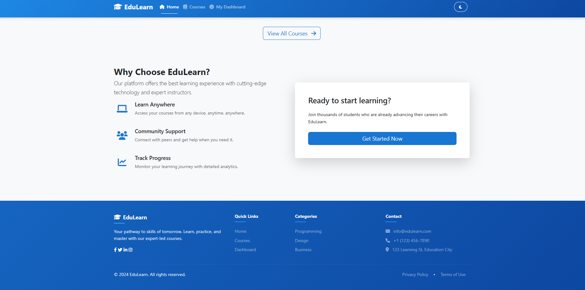
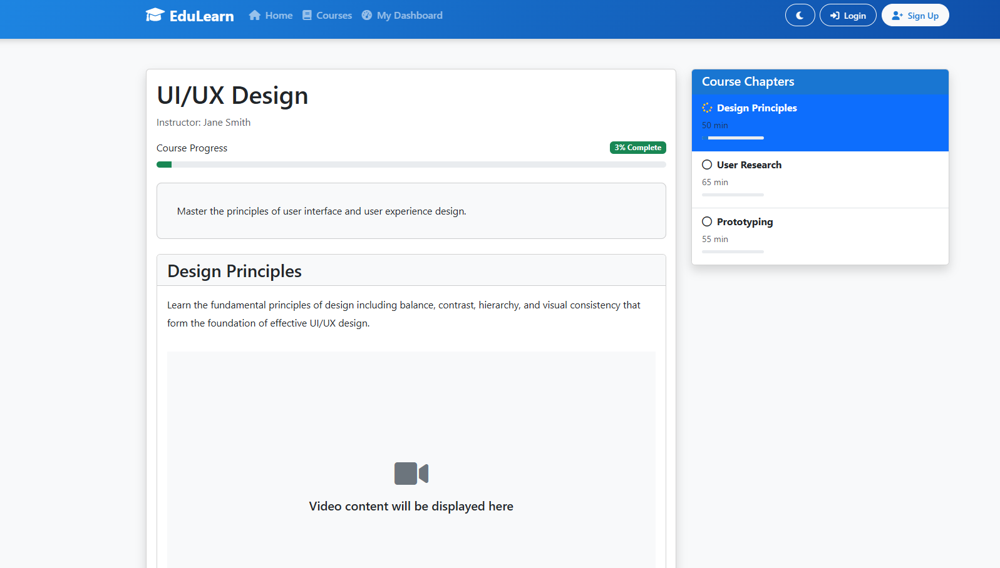
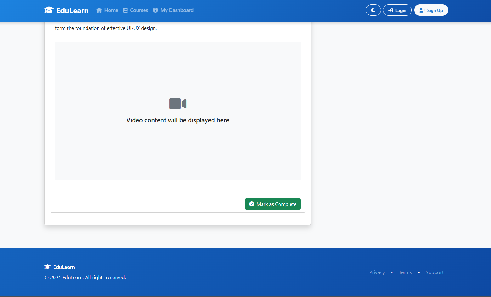
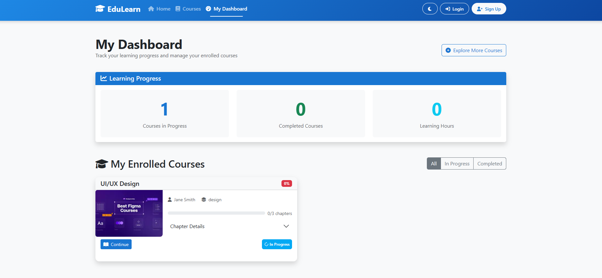

# EduLearn - Online Learning Platform

## Overview
EduLearn is a modern online learning platform built with HTML, CSS, and JavaScript. It offers an intuitive interface for students to browse courses, track their progress, and engage with educational content.

## Features
- 🎨 Modern UI with Dark/Light theme support
- 📱 Fully responsive design
- 📚 Course catalog with filtering options
- 📊 Student dashboard with progress tracking
- 📝 Chapter-based course content
- 💾 Local storage for course progress

## Screenshots

### Home Page

The landing page showcases featured courses and platform benefits.

### Course Catalog

Browse and filter available courses by category.

### Course Content

Structured chapter-based learning with progress tracking.

### Student Dashboard

Track your enrolled courses and learning progress.

## Technologies Used
- HTML5
- CSS3
- JavaScript (ES6+)
- Bootstrap 5
- Font Awesome Icons
- Local Storage API
